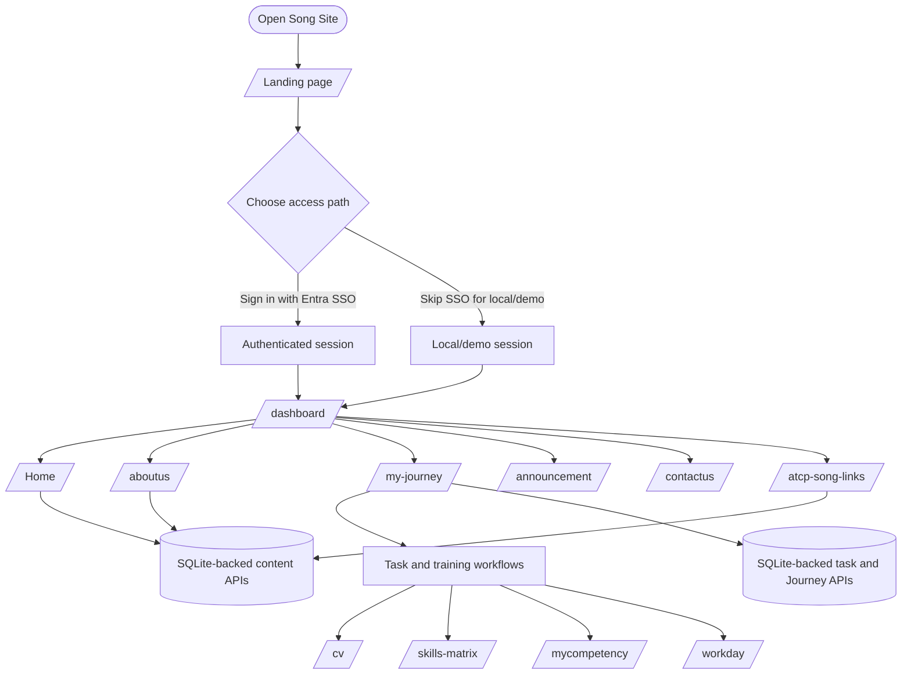
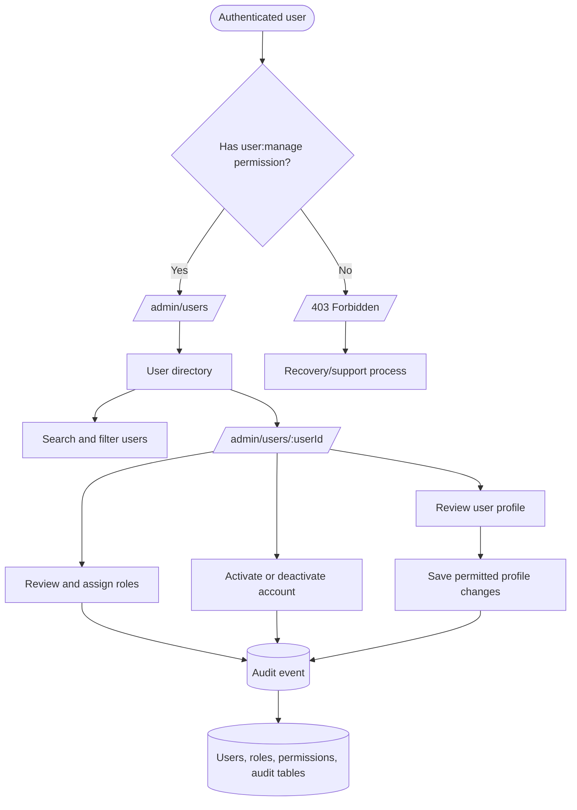

# Navigation Flows

These diagrams distinguish implemented navigation from the planned administration experience. A Mermaid renderer is required to display the diagrams.

## Main site flow

The landing page supports Microsoft Entra SSO or a local/demo bypass. The dashboard navbar exposes the current public and authenticated site areas.

### Current main-flow notes

- `/` is the landing and SSO entry point.
- `/dashboard` is the main home experience.
- `/atcp-song` is a leadership/content page, not a separate admin surface.
- `/contactus` is a general contact form, not user administration.
- The classic `/journey` route remains a separate legacy Journey experience and is not yet the shared database-backed workflow.

## Planned admin dashboard flow

The admin flow is designed but not implemented. It depends on authenticated identity claims, backend RBAC, user tables, and audit logging.

### Planned admin boundaries

- Planned landing route: `/admin/users`.
- Planned APIs: `GET /api/v1/users`, `GET /api/v1/users/:userId`, `GET/PUT /api/v1/users/:userId/roles`, and permitted user updates.
- Authorization must be enforced by the backend; Angular navigation is not a security boundary.
- Role assignment and account-state changes require audit events.
- Implementation is tracked by `WP-016`; RBAC foundations are tracked by `WP-007`.

## Status

| Flow | Status | Source |
| --- | --- | --- |
| Main landing and navbar | Implemented | `src/app/app.routes.ts`, `src/app/navbar/navbar.html` |
| Main content API integration | Implemented locally | `backend/server.js`, `backend/database.js` |
| Admin dashboard | Planned | `ADR-0015`, `WP-016` |
| Production authorization | Planned | `ADR-0005`, `ADR-0017`, `WP-018` |
