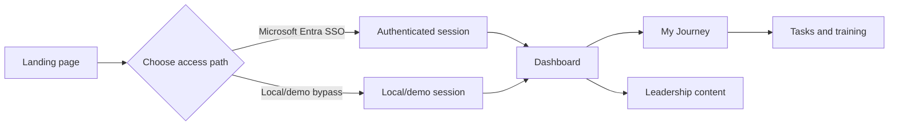

# Song Site: Journey, Leadership, and Delivery

**Audience:** ASEs and Associates  
**Format:** Markdown deck with presenter notes  
**Status:** Current-state overview; planned capabilities are labelled

> **Deck asset convention:** Replace each `Screenshot placeholder` block with a sanitized screenshot before presenting. Do not include real emails, tokens, client secrets, private URLs, or production data.

---

## Slide 1: Welcome to Song Site

### A practical guide to the experience and the engineering behind it

- **Journey:** move through milestones and learning activities
- **Tasks:** perform work and record progress
- **Leadership:** render shared leadership content in the dashboard
- **Delivery:** build, test, document, and deploy with repeatable controls

> **Presenter notes:**
>
> Song Site is both a user experience and an engineering system. Today we will connect what an Associate sees on screen with the work that makes that experience reliable. We will also distinguish what is working locally from what is still being prepared for production.

---

## Slide 2: The User Flow



- Start at the landing page
- Enter through SSO or the local/demo path
- Use the dashboard to reach Journey and content areas

> **Screenshot placeholder:** Capture the landing page and dashboard navigation in a local/demo environment. Show the SSO button, the local/demo path, and the main dashboard destinations. Crop out browser profile data and personal information.

> **Presenter notes:**
>
> The current application supports Microsoft Entra sign-in and a local/demo bypass. The bypass is useful for local exploration, but it is not an authorization mechanism. In a production design, public reads and protected mutations must be separated by backend policy.

---

## Slide 3: Journey Milestones

### Journey turns development into visible progress

- A milestone is represented by a task or learning activity
- Activities can link to supporting resources and learning platforms
- The Journey experience groups work into a path an Associate can follow
- Progress is visible through status and completion information

### Typical milestone movement

```text
Not Started -> Pending -> In Progress -> Completed
```

> **Screenshot placeholder:** Capture the Journey landing or milestone view showing several task cards with different statuses. Include one in-progress item and one completed item so the audience can see the visual distinction.

> **Presenter notes:**
>
> A milestone is not only a page to visit. It is a piece of work with a state. The important habit is to make the next action clear, then leave a reliable record of what happened. The application currently supports task and training data through backend APIs and database-backed content.

---

## Slide 4: Tasks: Perform and Mark Complete

### The task loop

1. Open the current task
2. Read the description, dates, and supporting links
3. Start the task when work begins
4. Perform the activity
5. Mark the task complete
6. Review the updated progress

### What the system records

- Status
- Progress percentage
- Start and completion dates
- Actual duration when available
- Description and external links

> **Screenshot placeholder:** Capture a task detail view before and after completion, or use two cropped screenshots side by side. Show the action control, status, progress, and completion information. Use seeded demo data only.

> **Presenter notes:**
>
> Marking a task complete is a state transition, not just a visual checkmark. The backend owns the persisted state, and the frontend presents that state. This distinction matters when several people or services need to trust the same progress record.

---

## Slide 5: Training and Supporting Work

### Journey is broader than one checklist

- Training tasks have their own API-backed records
- Learning activities can point to external platforms
- Supporting routes include CV, skills matrix, competency, and Workday experiences
- Parent-task and ownership rules are still part of the remaining hardening work

> **Presenter notes:**
>
> The application is designed to connect structured work with the places where learning happens. Some supporting experiences are informational links, while task status and progress belong to the Song Site data boundary. We should avoid implying that every external activity is automatically verified by the application.

---

## Slide 6: ATCP Song Leadership

### Leadership content is rendered data

- Leadership content is loaded through the leadership API
- The frontend groups records into sections such as market and practice leads
- The dashboard renders names, roles, initials, photos, and supporting metadata
- The current leadership page is a content-rendering surface, not an admin console

```text
Leadership API -> response sections -> Angular service -> dashboard rendering
```

> **Screenshot placeholder:** Capture the ATCP Song leadership page or dashboard section showing grouped leadership records, names, roles, and photos. Use approved sample content and remove any private contact information.

> **Presenter notes:**
>
> This is the key idea for the leadership dashboard: the page renders shared content from a defined API boundary. The UI should not become the source of truth. Administrative editing, role-based permissions, audit, and organizational-chart maintenance are separate planned capabilities.

---

## Slide 7: Software Delivery Framework

### Six controls answer six different delivery questions

| Control | Question it answers |
| --- | --- |
| **ADR** | What important technical choice did we make, and why? |
| **WP** | What work will turn that choice into a deliverable? |
| **Unit tests** | Does one small piece behave correctly by itself? |
| **Integration tests** | Do the pieces work together across an API or database boundary? |
| **Build scripts** | Can every developer and CI runner produce the same kind of artifact? |
| **Deployment scripts** | Can we release, check, and recover the artifact safely? |

### How they connect

```text
Decision -> Work package -> Code -> Tests -> Build -> Deployment -> Evidence
```

- Each control produces evidence for the next step
- A gap in one control is a delivery risk, not just missing paperwork
- “Implemented” means the evidence exists at the required level

> **Presenter notes:**
>
> These controls form a chain. The ADR explains the intent, the WP organizes the work, code implements it, tests challenge it, the build packages it, and deployment proves it can run in a target environment. They are not interchangeable: an ADR is not proof that code exists, and a passing build is not proof that an API, migration, or authorization rule works in production.

---

## Slide 8: Architecture Design Records

### ADRs capture durable technical decisions

Examples in this repository:

- Architecture baseline
- OpenAPI-first API design
- PostgreSQL and SQLite database strategy
- Frontend test strategy
- Identity and access lifecycle
- Azure deployment from GitHub Actions
- GitHub Actions Azure deployment automation

### Good ADR questions

- What problem are we solving?
- What did we decide?
- What alternatives did we reject?
- What are the consequences?
- How will we know the decision is implemented?

### When to create one

- A choice affects multiple modules or teams
- A database, API, identity, security, or deployment boundary changes
- The team needs a durable reason, not just a one-time implementation detail

> **Screenshot placeholder:** Capture the repository ADR index and one representative ADR opened in the editor. Highlight the status, context, decision, consequences, and completion criteria without showing unrelated private workspace information.

> **Presenter notes:**
>
> An ADR is a short decision record, not a design novel. Create one when a choice will outlive the current pull request or affect other people. The status matters: proposed means it needs review, accepted means the direction is approved, and neither status by itself proves implementation. For example, the Azure ADRs describe the target and pipeline design, but Azure resources and workflows are not yet implemented.

---

## Slide 9: Work Packages

### WPs turn decisions into deliverable work

A work package should identify:

- Scope and evidence
- Owner
- Status: Planned, In progress, or Implemented
- Related ADRs
- Completion criteria
- Remaining risks and dependencies

### How to use a WP

1. Start with a clear outcome, not a list of random tasks
2. Link the WP to the governing ADR or contract
3. Update status when evidence changes
4. Close it only when implementation, tests, security checks, and operational notes are present

### Examples

- `WP-009`: frontend verification
- `WP-029`: PostgreSQL compatibility, test layers, and CI gates
- `WP-033`: Microsoft Entra SSO and API authorization
- `WP-034`: GitHub Actions Azure deployment automation

> **Screenshot placeholder:** Capture the work-package table around `WP-009`, `WP-029`, `WP-033`, and `WP-034`. Make sure the status column is readable so the audience can see the difference between implemented, in progress, and planned.

> **Presenter notes:**
>
> A work package is the delivery view of architecture. It answers: what outcome are we responsible for, who owns it, how far along are we, and what remains? An Associate can use the WP to find the right starting point and the reviewer can use it to check whether the work is truly complete. A package can have working code and still be in progress when authorization, tests, migration parity, or deployment evidence is missing.

---

## Slide 10: Unit and Integration Tests

### Use the right test layer for the risk

**Unit tests**

- Angular components and services
- Mapping and status rules
- Focused backend repository behavior

**Integration tests**

- API routes with the repository
- Database migrations and constraints
- PostgreSQL compatibility and transactions
- Representative CRUD flows

**Browser tests**

- Login and redirect behavior
- Journey navigation
- Task completion workflows
- User-visible dashboard rendering

### A simple rule

```text
Fast feedback first -> boundary confidence next -> real user workflow last
```

- Unit tests are cheap and focused
- Integration tests catch contract, data, and environment mismatches
- Browser tests prove the critical path a user experiences
- A test should fail for a meaningful reason, not merely increase a coverage number

> **Screenshot placeholder:** Use a three-panel collage: a unit-test editor/spec result, a backend/API test result, and a browser test or application screen. Label each panel with its test layer and use sanitized local output.

> **Presenter notes:**
>
> Choose the test layer based on the risk. If a status-mapping function is wrong, a unit test is the fastest signal. If the API and database disagree, use an integration test. If routing, login, rendering, and API calls must work together, use a browser test. The repository has frontend specs and a backend database test, but PostgreSQL integration CI, complete API authorization coverage, and a committed Playwright configuration remain work in progress.

---

## Slide 11: Build and Deployment Scripts

### Repeatable commands are part of the product

Build and deployment scripts turn “this worked on my machine” into a repeatable team process. They should be:

- **Discoverable:** named in package scripts and runbooks
- **Repeatable:** safe for CI and other developers to run
- **Observable:** clear about pass/fail results
- **Environment-aware:** explicit about local, staging, and production differences

**Build and verification**

```powershell
npm run test:ci
npm run build:ci
npm run verify
cd backend
npm test
```

**Local database lifecycle**

```powershell
npm run db:migrate
npm run db:seed
npm run db:check
```

**Current deployment**

- GitHub Actions deploys the Angular frontend to GitHub Pages
- Dockerfiles build frontend and backend images
- Docker Compose provides an optional PostgreSQL/pgvector local stack

**Planned Azure pipeline**

- Verify -> build -> publish -> migrate -> deploy -> smoke test -> promote
- GitHub OIDC and seven-day ordinary artifact retention

### Build versus deployment

- **Build:** creates and checks the artifact
- **Deployment:** places the artifact in an environment and proves it works there
- **Promotion:** sends approved traffic to the verified release
- **Rollback:** returns application traffic to a known healthy revision when needed

> **Screenshot placeholder:** Capture the current GitHub Actions workflow file or Actions run summary showing the existing GitHub Pages deployment. Add a second placeholder for the future Azure pipeline diagram; do not imply that the Azure workflow is implemented.

> **Presenter notes:**
>
> Scripts make the expected path visible and repeatable. A build answers “can we produce the artifact?” Deployment answers “can the artifact run in this environment?” Promotion answers “are we ready to send users to it?” The current deployment is frontend-only on GitHub Pages. The Azure pipeline is planned, not implemented, and PostgreSQL is not installed in the current local environment.

---

## Slide 12: What to Remember

### Build the habit, not just the feature

- Follow the Journey milestone and record meaningful completion
- Treat leadership content as shared, API-backed data
- Link implementation work to a WP
- Record architectural changes in an ADR
- Test the layer where the risk lives
- Use build and deployment scripts instead of undocumented manual steps
- Be precise about what is implemented, in progress, or planned

### Next conversation

- What Journey milestone are you working on?
- What evidence will show it is complete?
- Which test and deployment gates does it need?

### A feature is complete when

- The user behavior works
- The API and data behavior are correct
- The relevant tests pass
- Security and authorization boundaries are covered
- The build is reproducible
- Deployment and rollback notes exist
- The WP evidence supports the status claim

> **Screenshot placeholder:** Capture a final Journey dashboard view with one realistic demo milestone and its next action visible. Use this as the closing visual and avoid showing personal identity or production data.

> **Presenter notes:**
>
> The goal is not paperwork for its own sake. The goal is a shared way of working where an Associate can understand the task, the system can record the result, and the team can verify and release the change with confidence.

---

## Source Notes

- [Navigation flows](../navigation-flows.md)
- [Engineering standards](../engineering-standards.md)
- [Work package tracking](../work-packages.md)
- [ADR index](../README.md)
- [Testing and release runbook](../runbooks/testing-and-release.md)
- [Azure deployment setup](../runbooks/azure-deployment.md)
